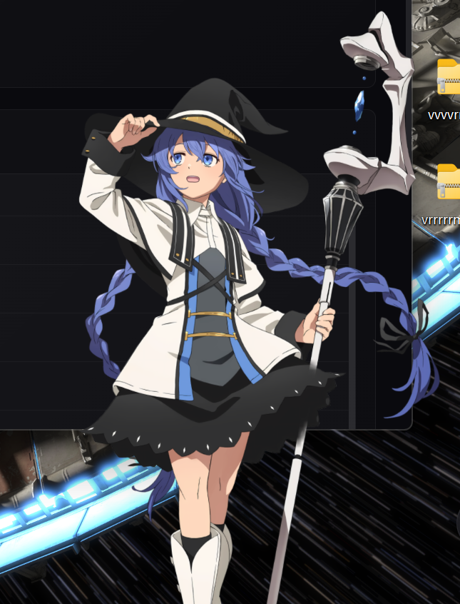
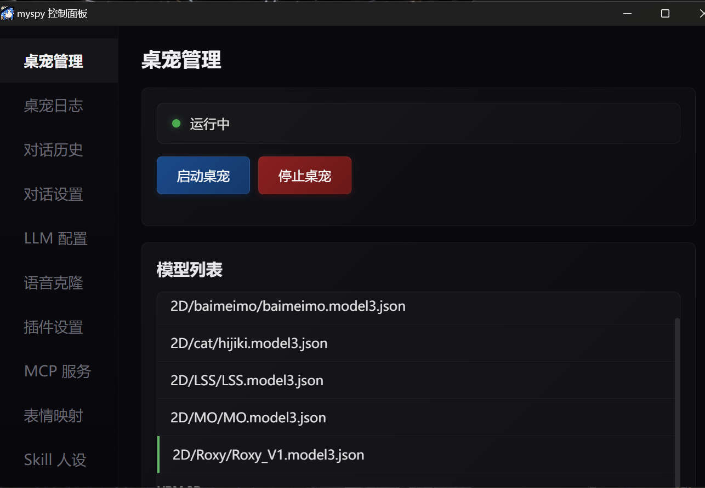

# myspy

<div align="center">
    <strong>myspy</strong> — 一个基于 Electron 的 AI 桌面宠物，Live2D / VRM 双模型，流式对话 + 本地语音 + 情绪表情。
  </p>
  <p>
    
    
    
    
  </p>
</div>


---

## 项目简介

myspy 是一个桌面 AI 陪伴应用。角色常驻桌面，能聊天、能说话、能做表情、能执行工具。

不只是接个模型聊聊天，而是把这些层拼到一起：

- **桌面存在感**：Live2D / VRM 角色常驻桌面 + 对话字幕 + 右键菜单
- **流式对话**：LLM 流式输出 + TTS 流式语音 + 字幕逐字显示
- **情绪表达**：自动检测情绪标签，驱动模型表情变化，10 秒后恢复
- **语音交互**：ASR 语音输入 + 按键说话 + 语音打断
- **插件系统**：17 个内置插件 + 7 个社区插件，热重载
- **MCP 工具**：文件操作、浏览器控制、系统工具、智能家居
- **Skill 人设**：预定义 AI 角色模板，一键切换人格

## 功能展示

| Live2D 桌宠 | WebUI 控制面板 |
|---|---|
|  |  |

## 核心特性

- **双模型支持**：Live2D（PIXI.js）和 VRM（Three.js）可切换
- **5 个 Live2D 模型**：baimeimo（23 个表情）、cat、MO、LSS、Roxy
- **流式 TTS**：GPT-SoVITS 本地语音合成，按标点分段，口型同步
- **情绪表情**：6 种情绪自动映射到模型参数，定时恢复
- **插件热重载**：修改插件文件后自动重新加载
- **Skill 人设**：SOUL.md + SKILL.md 定义角色，注入系统提示词
- **WebUI 控制面板**：独立窗口管理所有设置，实时生效

## Media Stack

### 桌宠层

- Live2D 模型：`2D/baimeimo/`、`2D/cat/`、`2D/MO/`、`2D/LSS/`、`2D/Roxy/`
- VRM 模型：`3D/midars.vrm`
- 渲染：PIXI.js + pixi-live2d-display / Three.js + @pixiv/three-vrm

### 语音层

- TTS：GPT-SoVITS 本地服务（`GPT-SoVITS-Bundle/`）
- ASR：FunASR + Silero VAD（`full-hub/`）
- 语音模型：`Voice_Model_Factory/明前奶绿/`

### 工具层

- MCP 工具：文件操作、浏览器控制、系统工具、小米智能家居
- 插件：代码执行、翻译、音乐、日记、截图、弹幕等 24 个

## 快速开始

### 环境要求

- **Node.js**: 18+
- **Python**: 3.11+（TTS/ASR 需要）
- **NVIDIA GPU**（推荐，TTS/ASR 需要 CUDA 加速）

### 安装与运行

```bash
# 1. 克隆项目
git clone https://github.com/yourname/myspy.git
cd myspy

# 2. 安装依赖
npm install

# 3. 启动
npm start
```

或直接双击 `启动.bat` / `启动.vbs`。

### 配置

编辑 `config.json`：

```json
{
  "llm": {
    "api_url": "https://your-api.com/v1",
    "api_key": "your-api-key",
    "model": "your-model"
  }
}
```

## 项目结构

```
myspy/
├── main.js              # Electron 主进程
├── app.js               # 渲染进程（核心逻辑）
├── config.json          # 配置文件
├── 2D/                  # Live2D 模型
├── 3D/                  # VRM 模型
├── js/                  # 核心模块
│   ├── core/            # 插件管理、事件总线、状态管理
│   ├── model/           # 模型加载与交互
│   ├── mcp/             # MCP 工具
│   ├── llm-client.js    # LLM 客户端
│   ├── tts-client.js    # TTS 客户端
│   └── asr-client.js    # ASR 客户端
├── webui/               # 控制面板
├── plugins/             # 插件系统
├── skills/              # Skill 人设模板
├── mcp/                 # MCP 工具配置
├── libs/                # 第三方库
└── GPT-SoVITS-Bundle/   # TTS 引擎
```

## 所有 Skill 和提示词都要加上

### 情绪标签（必须使用）

每句话开头必须加情绪标签，选最符合当前心情的：
`<开心>` `<生气>` `<难过>` `<惊讶>` `<害羞>` `<俏皮>`
不加标签就没有表情动画。

### 搜索工具使用规范

搜索时把完整问题作为关键词，不要拆开搜。比如用户问"明天天气怎么样"就搜"明天天气预报"，不要只搜"明天"。

## 致谢

| 项目 | 说明 |
|------|------|
| [milkgreen-skill](https://github.com/colourfulmaster/milkgreen-skill) | 明前奶绿 Skill 人设模板 |
| [Roxy-SKILL](https://github.com/umikok7/Roxy-SKILL) | 洛琪希 Skill 人设模板 |
| [my-neuro](https://github.com/Kanagawa-ai/my-neuro) | AI 桌宠原始架构 |
| [GPT-SoVITS](https://github.com/RVC-Boss/GPT-SoVITS) | 本地语音合成 |
| [pixi-live2d-display](https://github.com/guansss/pixi-live2d-display) | Live2D 渲染 |

## 自定义

### 换模型

把 Live2D 模型放到 `2D/` 目录，或 VRM 模型放到 `3D/` 目录，在 WebUI "模型列表"切换。

### 换角色

在 `skills/` 下新建文件夹，创建 `SOUL.md`（角色灵魂）和 `SKILL.md`（行为规则），WebUI 里启用即可。

### 换语音

替换 `Voice_Model_Factory/` 下的语音模型文件，修改 `config.json` 中的 TTS 配置。

### 加插件

在 `plugins/built-in/` 或 `plugins/community/` 下新建目录，包含 `index.js` + `metadata.json`，自动识别。

## 灵感来源

| 项目 | 贡献 |
|------|------|
| [my-neuro](https://github.com/Kanagawa-ai/my-neuro) | AI 桌宠原始架构 |
| [GPT-SoVITS](https://github.com/RVC-Boss/GPT-SoVITS) | 本地语音合成 |
| [pixi-live2d-display](https://github.com/guansss/pixi-live2d-display) | Live2D 渲染 |

## License

MIT License
